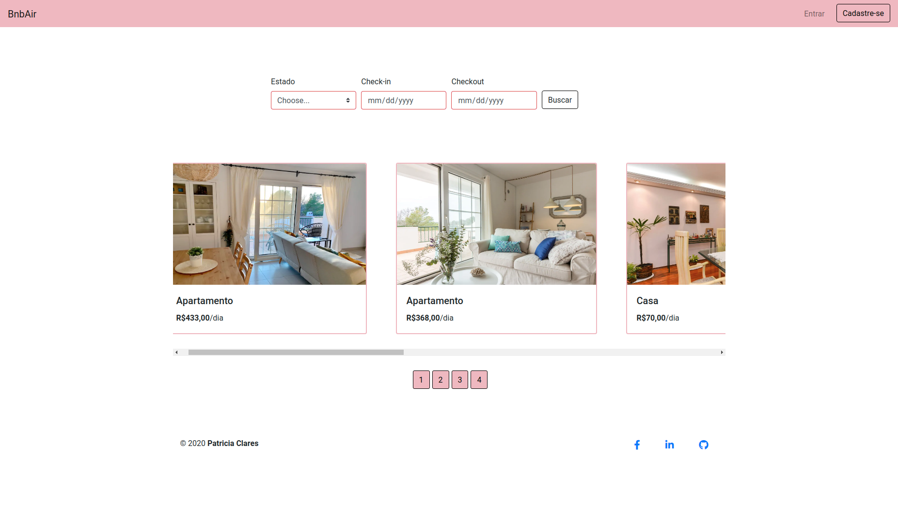
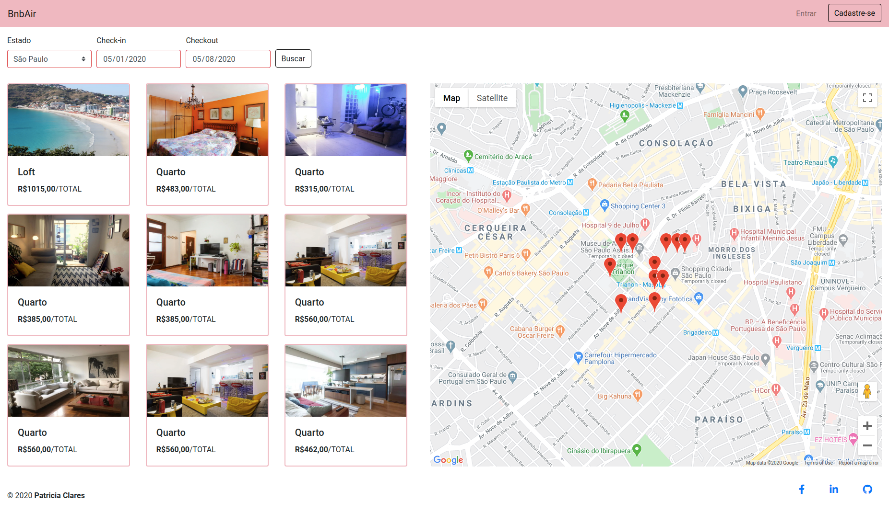

# BnbAir

### **Projeto desenvolvido com [HTML](https://www.w3schools.com/html/default.asp), [CSS](https://www.w3schools.com/css/default.asp), [Javascript](https://developer.mozilla.org/en-US/docs/Web/JavaScript), [Booststrap](https://getbootstrap.com/) e [Netlify](https://www.netlify.com/)**

Este projeto foi desenvolvido para listar e mostrar em um mapa as estadias por regiões e seus preços, os preços variam de acordo com a quantidade de dias.

### API externas
- [google Maps](https://cloud.google.com/maps-platform/?_ga=2.152082745.1057290785.1589132901-104666352.1588987426&_gac=1.158331336.1588995617.Cj0KCQjwhtT1BRCiARIsAGlY51IVbL1mbwgBvSBG2zN7V3_Owj3RkYI9UD78rCzt_KUlFjOfKPeJmRcaAnWFEALw_wcB)
- [Jsonbin](https://jsonbin.io/)

- [API fornecida pelo Gama Academy](https://api.sheety.co/30b6e400-9023-4a15-8e6c-16aa4e3b1e72)
---

### Desenvolvimento
Para iniciar o desenvolvimento, é necessário clonar o projeto do GitHub num diretório de sua preferência:
```shell
cd "diretorio de sua preferencia"
git clone https://github.com/PatriciaClares/bnbair
```
Em seguida abra o projeto na sua IDE.

---
### Link da hospedagem
- https://bnbair-hc.netlify.app/

### Imagens

*Página principal*


*Página do Maps*


